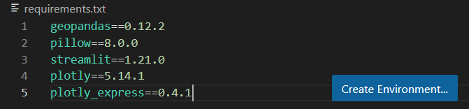
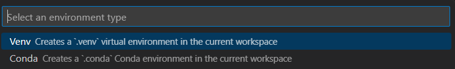
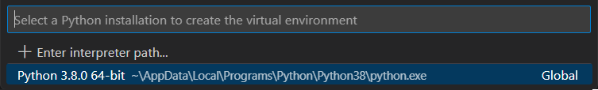
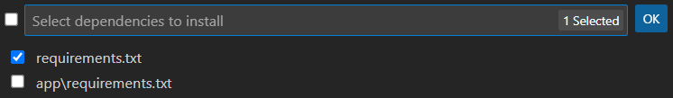
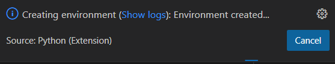
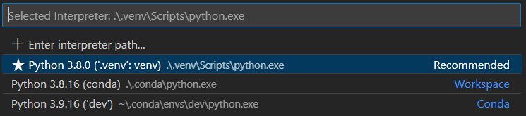
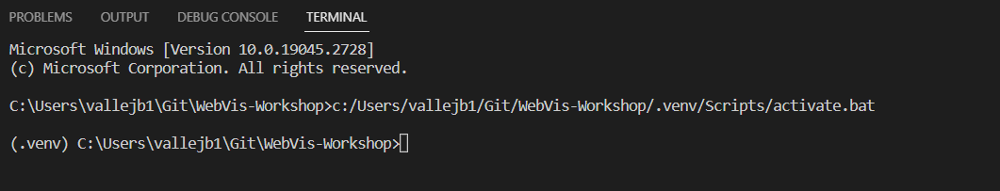

# Web Visualization Workshop 

This Repo contains a web app developed in Streamlit presented as demo at the "Web Visualization Workshop 2023" at Aalto Geoinformatics Research Lab. Get familiar with the documentation of "Scenarios" to test all capabilities of the web app.

## 1. Install Python local environment

Start cloning or downloading the repository in your computer and open it with [Visual Studio Code](https://code.visualstudio.com/). The VSCode is a text editor very popular for coding and it can install extensions based on the needs, for example, you can install the Python programming extension that will help you to create this environment easily.

If you are willing to work locally and practice Web App development it is highly recommended to install a local enviroment. We will guide with VSCode but feel free to do it on your way way if you have already the knowledge. For this Workshop we need the next requirements.

- [Visual Studio Code](https://code.visualstudio.com/) installed on your computer.
- [VSCode Python Extension](https://marketplace.visualstudio.com/items?itemName=ms-python.python) installed on your computer.
- [Python 3.8.0](https://www.python.org/downloads/release/python-380/) installed. Download clicking here for [Windows64bit](https://www.python.org/ftp/python/3.8.0/python-3.8.0-amd64.exe) and for [MacOS64bit](https://www.python.org/ftp/python/3.8.0/python-3.8.0-macosx10.9.pkg).

Then, follow the instructions about how to install your own virtual environment.

1. Open the [requirements.txt](requirements.txt) file in VSCode. Then, click on *Create Environment...*
    
    

2. Then, you have to select the environment type. For files like *requirements.txt* you need to choose **Venv**. 

    

3. Then, you have to select the Python version for your environment providing the folder path of the executable file on your system. In the case you don't have the path already given you can find Python path in the *Start Menu*, then, right click on the icon, *Properties*

    

4. Then, you select the *requirements.txt* file located in the root folder.

    

5. Then, the *.venv* is going to be installed in the root folder and you will receive a notification from VSCode. You can click on *Show logs* if you want to read the specifications of the installation.

    

6. Then, open the *CDM Terminal*.
    
7. Finally activate your local environment. Open the file `mywebapp.py` on VSCode, then type `Ctrl + Shift + p` and write *select interpreter* and you will choose your local *venv* environment.

    

8. At the end your terminal will look like this with the *venv* active.

    

## 2. Run locally the Web App "Scenarios" 

