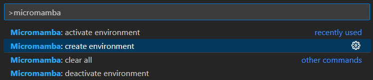
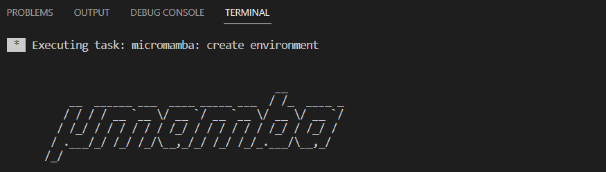
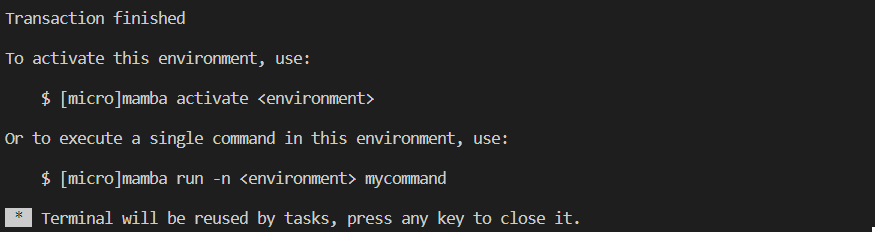
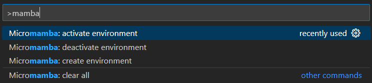
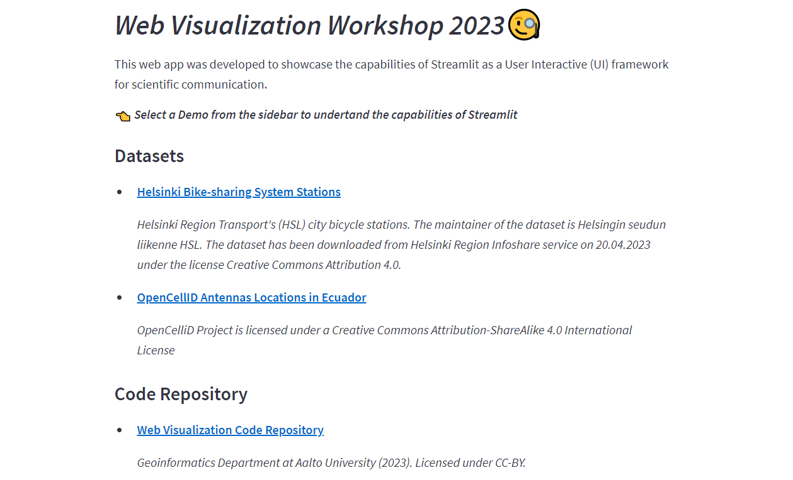
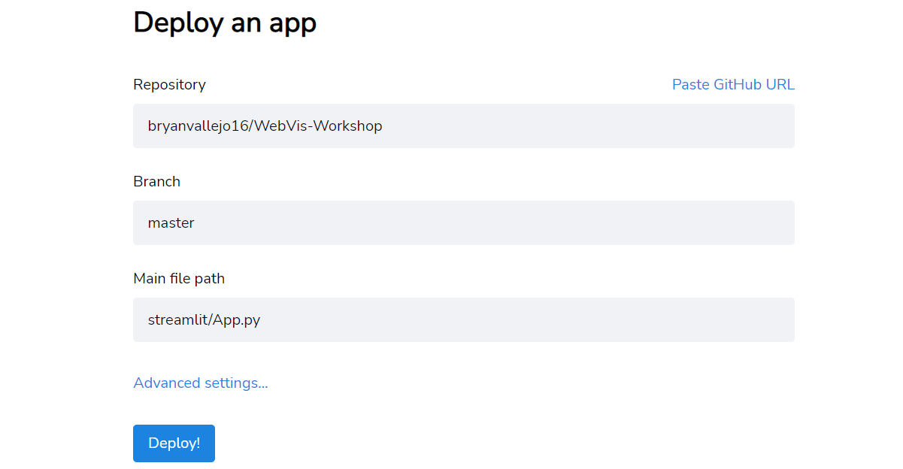
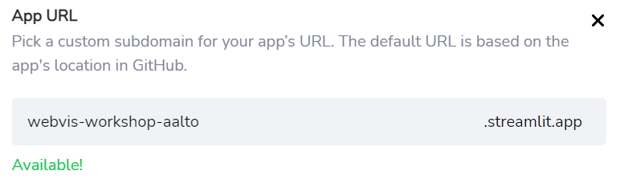

# Web Visualization Workshop 

This Repo contains web apps developed in Streamlit presented as demo at the "Web Visualization Workshop 2023" at Aalto Geoinformatics Research Lab. 

👉 Access the Web App here: [WebVis Workshop Streamlit App](https://webvis-workshop-aalto.streamlit.app/Helsinki_Bike_Stations)

# 1 Install a Python local environment

This Workshop will be guided with VSCode and Micromamba. VSCode is a text editor very popular for coding and it enables the installation of extension that supports coding and give extra functionalities, for example, you can install the Micromamba extension that will help you to create a Conda environment environment easily.

If you are willing to work locally and practice Web App development it is highly recommended to install a local enviroment. We will guide with VSCode but feel free to do it on your own way if you have already the experience. 

For this Workshop please install the next software on your computer.

- [Visual Studio Code](https://code.visualstudio.com/) installed on your computer.

- [Micromamba Extension](https://marketplace.visualstudio.com/items?itemName=corker.vscode-micromamba) installed on your computer.

Then, follow the next instructions about how to install your own virtual environment.

***Note! It is better if you first fork this repository because later on you might need access right for deployment.***

1. **Fork it**, then clone or download this repository on your computer.
2. Open the Repository folder with *VSCode*
3. Press `Ctrl + Shift + p` and type `micromamba`, then click on *create environment*. This command works only when you have a *environment.yml* file in the root folder.

    

    -> You will see how it will start running mamba.

    

    -> Once it is installed you will receive the next message.

    

4. Press `Ctrl + Shift + p` and type `micromamba`, then click on *activate environment*. As an alternative, you can open a *Command Prompt* terminal in VSCode and type `micromamba activate appenv`

    

    -> Finally, your terminal will have `(appenv)` at the beginning.

# 2 Run locally the Streamlit Web App

Once you have installed your local Python environment and it is activate in the *Command Prompt* terminal. Run the the Streamlit Web App so we can start practicing some development in this workshop. 

First, be sure that your root folder is the repository.

Then, to inititate the Streamlit web app run:

```
streamlit run streamlit/App.py
```
This command will open a Localhost in your browser where you will find information about the *Hello* web app. It might look like:



# 3 Deployment

In order to deploy you need to have this repository **in you own GitHub account**. The best way is that you fork it, clone it, and then edit the exercises, then deploy it. As it was explained before the environment creation.

Follow the next steps to have it deployed.

1. Access to [Streamlit Cloud](https://share.streamlit.io/) with your GitHub credentials

2. Click on the blue button *New App* and configure the paths like.

    

3. Be sure that the *"Main file path"* is `streamlit/App.py`

4. In advanced *Advanced settings* choose **Python 3.10**, and press **Deploy**

5. You will see that **Your App is the oven** 

6. Once it is deployed you can go back to your apps in Streamlit Cloud and change the URL if you wish.

    

Then, just access to your link and share the app.

## 👉 Web App: [*webvis-workshop-aalto.streamlit.app*](https://webvis-workshop-aalto.streamlit.app/)


